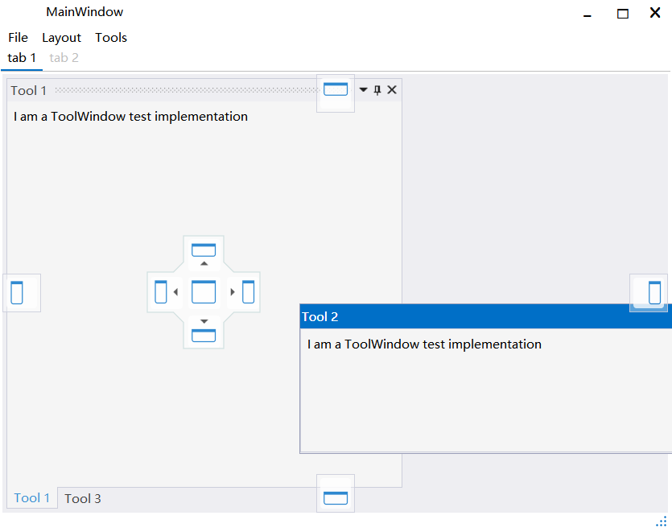
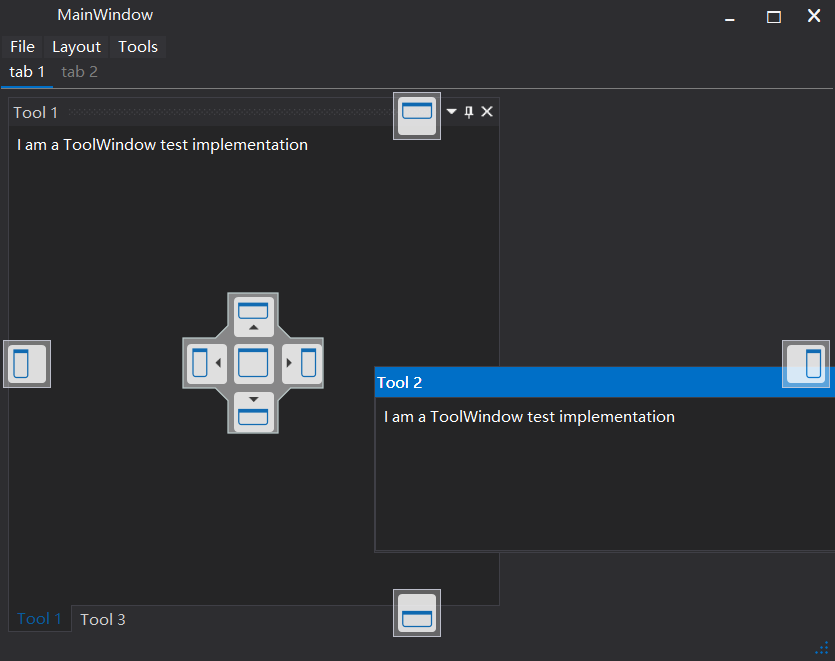
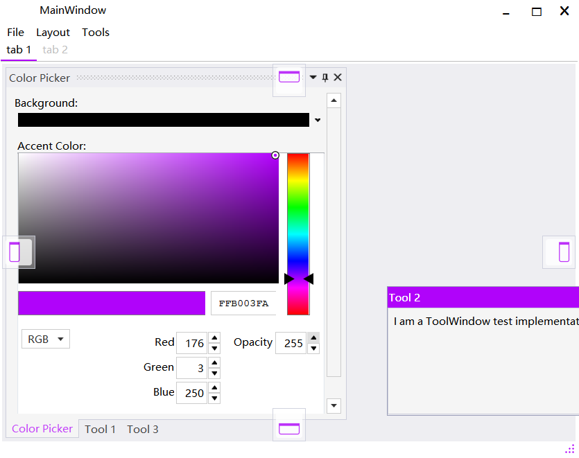

# 修改 Themes.VS2013 OverlayWindow的样式

<table width="100%">
   <tr>
      <td>Light</td>
      <td></td>
   </tr>
   <tr>
      <td>Dark</td>
      <td></td>
   </tr>
   <tr>
      <td>Change Accent Color</td>
      <td></td>
   </tr>
</table>

